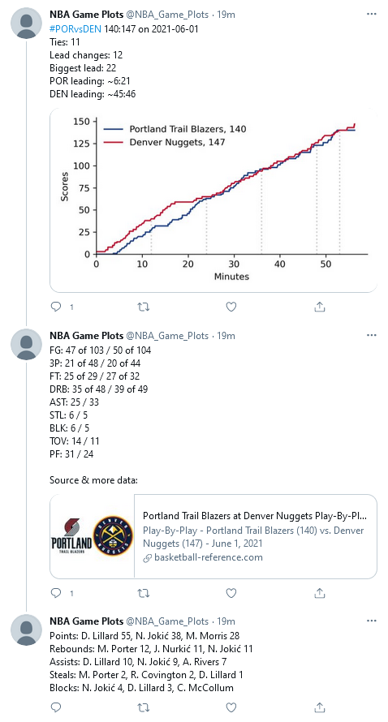

# NBA Game Plots 🏀

NBA box scores often don't tell the full story: In a clear game both teams might rest their stars
and let their bench players gain experience towards the end. In a tight game, on the other hand,
the loosing team often tries to gain additional posessions by fouling, which can lead to both, a
closer or a wider gap. To get a fuller picture, we tweet plots along some basic statistics.

Based on the data of [Basketball Reference](https://www.basketball-reference.com). Deployed to 
[Heroku](https://heroku.com/) following this [Tutorial](https://medium.datadriveninvestor.com/making-a-quote-tweeting-twitter-bot-with-python-tweepy-and-heroku-69a11cd3f47e)
and tweeting as [@NBA_Game_Plots](https://twitter.com/NBA_Game_Plots) like this:

